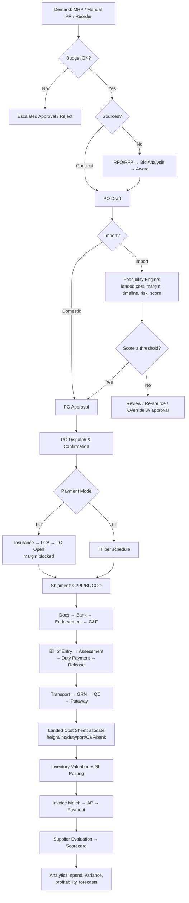

# 01 — Business Requirements Specification (BRS)

## 1. Business Context & Stakeholders

| Stakeholder | Interest |
|---|---|
| CFO / Finance Director | True landed cost, margin protection, LC exposure, budget control |
| Head of Procurement / Supply Chain | Cycle time, savings, supplier performance, compliance |
| Commercial / Import Manager | Document accuracy, clearance speed, bank coordination |
| C&F Agent (external) | Document handover, assessment status, charge billing |
| Bank Trade Desk (external) | LC application quality, document compliance |
| Warehouse / Store Manager | Receipt accuracy, batch traceability |
| Accounts Payable | 3-way match, accruals, vendor payments |
| Auditors / NBR | Audit trail, duty payment evidence, BIN/VAT records |
| Group Management | Cross-company spend visibility (multi-entity tenants) |

## 2. Business Goals → Requirements Traceability

| Goal | Business Requirement (BR) |
|---|---|
| G1 Know landed cost before commitment | BR-01 Feasibility analysis must run automatically at PO creation with predicted landed cost, margin, timeline, score |
| G2 Eliminate duty calculation errors | BR-02 System computes BD duty cascade from HS code + dated rate tables; manual override requires reason + approval |
| G3 Control spend | BR-03 Every PR/PO validated against budget; over-budget requires escalated approval |
| G4 Reduce import cycle time | BR-04 Single import file workspace tracks all documents, milestones, and parties with SLA alerts |
| G5 Manage bank exposure | BR-05 LC register with margin, outstanding, maturity, amendment, and back-to-back linkage views |
| G6 Improve supplier base | BR-06 Vendor qualification workflow + periodic scorecards driving an approved-vendor list per category |
| G7 Accurate inventory & GL | BR-07 Actual landed cost posts to inventory valuation and GL automatically on shipment cost-sheet finalization |
| G8 Multi-entity governance | BR-08 Tenant supports multiple companies/business units/factories with consolidated and isolated views |
| G9 Compliance & audit | BR-09 Immutable audit trail, document vault with retention, role-segregated duties (maker/checker) |

## 3. Source-to-Pay (S2P) Lifecycle

```
Need Identification → Sourcing Strategy → Supplier Discovery → Supplier Qualification
→ RFQ/RFP → Bid Collection → Quotation Comparison & Bid Analysis → Negotiation
→ Contract / Rate Agreement → Purchase Requisition → PO (with Feasibility Gate)
→ Order Confirmation → Fulfilment (Domestic OR Import lifecycle) → Goods Receipt
→ Quality Acceptance → Invoice → 3-Way Match → Payment → Supplier Evaluation → Scorecard
```

**Stage rules (selected):**
- Sourcing strategy mandatory for spend categories above tenant-defined threshold (e.g., BDT 50 lakh/yr): single/dual/multi-source decision recorded.
- RFQ minimum 3 qualified bidders for purchases > BDT 5 lakh (tenant-configurable); waivers require Head of Procurement approval with justification code (urgency / proprietary / OEM).
- Award decision must reference the bid analysis record; price-only awards flagged when TCO ranking differs.
- Contract precedence: PO under a valid rate contract inherits price/terms; off-contract purchases against contracted items raise a maverick-spend flag.
- Evaluation: every closed PO contributes delivery, quality, and responsiveness datapoints to the vendor scorecard automatically.

## 4. Procure-to-Pay (P2P) Lifecycle

```
PR Draft → PR Approval (hierarchy) → Budget Reservation → Sourcing (RFQ or contract call-off)
→ PO Draft → Feasibility Analysis (imports) → PO Approval → PO Dispatch → Acknowledgement
→ ASN/Shipment → GRN → QC → Putaway → Invoice Capture → 3-Way Match (PO↔GRN↔Invoice)
→ Exception Resolution → AP Voucher → Payment Run → Budget Consumption Posting → PO Closure
```

**Match tolerances (tenant defaults):** price ±2%, quantity ±1% or 0 for batch-controlled items, tax exact. Out-of-tolerance → exception queue with reason codes (price variance, qty variance, tax variance, missing GRN). Auto-close PO when received ≥ ordered − tolerance and all invoices matched.

## 5. Import-to-Inventory Lifecycle (Bangladesh)

```
Import Plan → Import PO → Proforma Invoice (PI) accepted
→ Insurance Cover Note (marine policy — prerequisite for LC in BD)
→ LCA Form + IRC validation → LC Application → Bank opens LC (margin blocked)
→ [or TT advance per Bangladesh Bank limits / bank contract]
→ Supplier production → Pre-shipment inspection (if required)
→ Shipment booked → Commercial Invoice + Packing List + BL/AWB + COO issued
→ Shipping documents to bank → Document scrutiny → Acceptance/Payment at maturity
→ Bank endorsement of BL → Documents to C&F agent
→ IGM noting → Bill of Entry submission (ASYCUDA World)
→ Customs Assessment (HS verification, valuation) → Duty Payment (CD/RD/SD/VAT/AIT/AT)
→ Physical examination (risk-lane: green/yellow/red) → Out-pass / Release Order
→ Port charges & demurrage settlement → Inland transport → Factory gate
→ GRN + QC → Batch/lot creation → Landed Cost Sheet finalization
→ Inventory valuation update → GL posting → Import file closure
```

**Critical business rules:**
- IMP-01: No LC application without accepted PI, valid IRC, HS-code-classified items, and insurance cover note reference.
- IMP-02: LC margin % per bank arrangement captured at opening; blocked amount tracked as restricted cash.
- IMP-03: Bill of Entry line items must reconcile to CI lines; quantity/value mismatches logged as assessment variances.
- IMP-04: Duty computed by system from dated HS rate tables MUST be compared to customs assessment; variance > tolerance creates a dispute-tracking record (appeal/refund workflow).
- IMP-05: Demurrage clock starts at port-defined free days from landing; system alerts at 70% of free time.
- IMP-06: File cannot close until all cost elements (freight, insurance, duty, port, C&F, bank, transport) are invoiced or accrued.
- IMP-07: AIT and AT (advance VAT) are recorded as advance tax assets when the tenant elects adjustment treatment; otherwise rolled into landed cost — tenant-level accounting policy flag, overridable per consignment by Finance.

## 6. End-to-End Business Process Flow



## 7. Cross-Cutting Business Requirements
- **Multi-currency:** transaction currency + tenant base currency (BDT default); exchange rates dated, source-tagged (Bangladesh Bank / bank deal rate); realized/unrealized FX on LC settlement.
- **Document vault:** every artifact (PI, CI, PL, BL, LC copy, BoE, duty challans, cover note) versioned in S3 with metadata, OCR-extracted fields, and retention ≥ 6 years (NBR requirement).
- **SLA engine:** each lifecycle stage has tenant-configurable target durations; breaches notify owners and appear on the executive dashboard aging widget.
- **Maker–checker:** financially significant masters (vendor bank accounts, duty rates, exchange rates) require dual control.
- **Localization:** Bangla/English UI, BD fiscal year (July–June) reporting alongside calendar year, NBR challan formats.

## 8. Out of Scope (v1)
Export management (EXP, back-to-back consumption against export LC is referenced, not managed), production planning/MRP (consumes via API), payroll/HR, e-payment execution to banks (payment instructions are generated, not executed).
